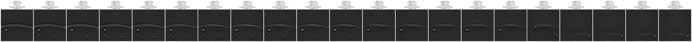

# OADAT-LDM: Latent Diffusion Models for Domain Adaptation in Optoacoustic Imaging
### Abstract:
Optoacoustic (OA) imaging is a non-invasive biomedical imaging technique with high potential, providing optical contrast complementary to ultrasound by stimulating tissue with laser pulses. Synthetic OA data are easier to generate and annotate, but they often lack the detailed anatomical features and realistic noise patterns found in experimental OA images. This gap limits the usefulness of synthetic data in developing OA image processing methods. In this study, we investigate diffusion-based domain adaptation strategies, using diffusion, classifier-guided diffusion, latent diffusion, and conditional variational autoencoder (CVAE) approaches to transform synthetic OA images into experimental-like images. Our methods are evaluated on the standardized public OA dataset, focusing on adding key features such as skin gradients, tissue textures, vessel details, and acquisition-induced noise. Our image-space diffusion model consistently produces high-fidelity adaptations that preserve anatomical structures and match experimental characteristics. These results offer a solid framework for enhancing the realism of synthetic OA data, potentially reducing the need for large clinical datasets for model training, and supporting the advancement of OA image processing algorithms.[^2]

[^2]: This is the paper of my semester project. \
co-supervisor: Firat Ozdemir \
supervisor: Prof. Fernando Perez-Cruz.


This repo provides diffusion-based methods to adapt synthetic forearm optoacoustic data into experimental-like data. The dataset used in this work, OADAT, is publicly available and described in *[OADAT: Experimental and Synthetic Clinical Optoacoustic Data for Standardized Image Processing](https://openreview.net/forum?id=BVi6MhKO0G)*.

---

## Environment

```bash
micromamba create -f environment-runai.yml
micromamba activate oadatldm
```

---

## Sampling with Different Models

There are three sampling scripts: `sampler_dm.py`, `sampler_dm_batch.py`, and `sampler_ldm.py`.

To run them (see also `run_on_runai_sampler_dm.py`, `run_on_runai_sampler_dm_batch.py`, and `run_on_runai_sampler_ldm.py` in the `run_on_runai_commands` folder):

```bash
python sampler_dm.py --oadat_dir /mydata/dlbirhoui/firat/OADAT --gpus 1
# or
python sampler_dm_batch.py --oadat_dir /mydata/dlbirhoui/firat/OADAT --gpus 1
# or
python sampler_ldm.py --oadat_dir /mydata/dlbirhoui/firat/OADAT --gpus 1
```

Replace `/mydata/dlbirhoui/firat/OADAT` with the path to your OADAT dataset.

### Sampled with the Diffusion Model

`sampler_dm.py` offers a flexible way to adapt a single image with one or multiple settings using the diffusion model. If you do not need fine-grained control or require higher efficiency for batch processing, see the next section: [Sampled with the Diffusion Model in Batch](#sampled-with-the-diffusion-model-in-batch).

In the main function you can customize the `output_dir` and choose the diffusion model configuration. You can also specify the classifier configuration if you wish to add classifier guidance. The `model_name` variable only affects the prefix of the output filename, and `batch_indices` should be set to the IDs of the synthetic images you want to adapt.

```python
output_dir = "./assets/report"
config = load_config_from_yaml(
    "/mydata/dlbirhoui/chia/oadat-ldm/config/diffusion-model.yaml"
    # "/mydata/dlbirhoui/chia/oadat-ldm/config/diffusion-model-epsilon.yaml"
)
clf_config = load_config_from_yaml(
    "/mydata/dlbirhoui/chia/oadat-ldm/config/classifier-guidance.yaml"
)
model_name = "dm"
...
batch_indices = np.array([19960])
```

In the main function you can also define the settings for each generated image. Typically, the first five parameters are used: `seed`, `use_classifier_guidance`, `classifier_scale`, `forward_timestep`, and `backward_timestep`. The parameter `num_cols` controls the layout of the output grid. For example, if there are 14 images and `num_cols` is set to 7, the grid will be 2 rows by 7 columns; if set to 14, the grid will be 1 row by 14 columns. The `filename_info` variable affects the postfix of the output filename.

The `guidance_start` and `guidance_stop` parameters allow finer control over the application of classifier guidance. If `two_stage` is `True` and `backward_timestep` is larger than `forward_timestep` (e.g., backward: 600, forward: 400), the process first denoises from 400 to 0 and then from 200 to 0. If `two_stage` is `False`, the image is treated as if it is at timestep 600, even though noise was added for only 400 steps, and then denoised directly from 600 to 0.

```python
# --- Define Parameter Combinations ---
# Each dictionary specifies one configuration for one output image.
# Keys:
#   seed: random seed for noise generation
#   use_classifier_guidance: whether to use classifier guidance
#   classifier_scale: scale for the classifier gradient
#   forward_timestep: number of timesteps used to add noise (forward process)
#   backward_timestep: total number of denoising steps (backward process)
#   guidance_start/guidance_stop: apply guidance only during these backward steps
#   two_stage: if True and backward_timestep > forward_timestep, apply two-stage denoising.
param_combinations = [
    {
        "seed": config.seed,
        "use_classifier_guidance": True,
        "classifier_scale": scale,
        "forward_timestep": 600,
        "backward_timestep": 600,
        "guidance_start": 600,
        "guidance_stop": -1,
        "two_stage": False,
    } for scale in range(0, 35, 5)
]
num_cols = 7
filename_info = "diffscale_fullguide"
```
Demo:


### Sampled with the Diffusion Model in Batch

`sampler_dm_batch.py` provides a faster way to adapt a batch of images with the diffusion model. Adjust the parameters or configuration file as needed:

```python
forward_timestep, backward_timestep = 500, 500
guidance_start, guidance_stop = 500, -1
num_sampling = 50
use_classifier_guidance = True
classifier_scale = 25
output_dir = "./assets/report"
config = load_config_from_yaml(
    "/mydata/dlbirhoui/chia/oadat-ldm/config/diffusion-model.yaml"
)
clf_config = load_config_from_yaml(
    "/mydata/dlbirhoui/chia/oadat-ldm/config/classifier-guidance.yaml"
)
model_name = "dm_scd_batch_classifier_guidance_2"  # config.wandb.job_name
seed = config.seed
```

To sample from pure noise, set:
```python
sample_from_pure_noise = True
```

Modify `batch_indices` to the indices of the images to be adapted:
```python
batch_indices = np.load("/mydata/dlbirhoui/chia/oadat-ldm/config/scd_500px_blob_test_indices.npy")
batch_indices = batch_indices[:num_sampling]
```

You can also plot the noise-injected images and the original synthetic images as separate files by including `"original"` and `"noisy"` in the `plot_results` list:
```python
plot_results = ["denoised", "original", "noisy"]
```
This will generate a grid (n by 10) depending on the number of images. If generating a large grid at once is too memory-intensive, use the `paste.py` script to combine two grids (one on top of the other).

Demo:


### Sampled with the Latent Diffusion Model in Batch

`sampler_ldm.py` offers similar functionality to `sampler_dm_batch.py` but uses latent diffusion. The autoencoder is selected automatically based on the latent diffusion configuration, so you do not need to choose the correct autoencoder or its checkpoints.

To adapt using only a conditional VAE without the diffusion process, set:
```python
sample_from_cvae_only = True
```

For both diffusion and latent diffusion, if you wish to adapt data from different datasets or subcategories, modify:
```python
scd_fname_h5 = "SCD_RawBP.h5" 
scd_key = "vc_BP"
```

Adjust the `num_row` and `num_col` parameters in the `plot_batch_results` function as needed.

---

## Model Definition

The `./model` directory contains all model definitions:
- **DDIM.py:** the diffusion model
- **UnetClassifier.py:** the classifier for classifier guidance
- **LatentDomainClassifier.py:** the classifier for aligning latent spaces of experimental and synthetic data during VAE training
- **VAE.py:** VAE with domain classifier applied before sigmoid
- **VAE_after_sigmoid.py:** VAE with domain classifier applied after sigmoid
- **CVAE_after_sigmoid.py:** Conditional VAE with domain classifier applied after sigmoid
- **LDM.py:** latent diffusion using a VAE
- **LDMWithCVAE.py:** latent diffusion using a CVAE (conditioned on the experimental label)

The `./losses` directory contains the loss functions for training VAEs and CVAEs.

---

## Training Models

Scripts starting with `train_` are used for training. PyTorch Lightning is employed as the training framework.

### Diffusion Model – V-Prediction
```bash
python train_diffusion.py --oadat_dir /mydata/dlbirhoui/firat/OADAT --gpus 1 --config_path /mydata/dlbirhoui/chia/oadat-ldm/config/diffusion-model.yaml
```

### Diffusion Model – Epsilon Prediction
```bash
python train_diffusion.py --oadat_dir /mydata/dlbirhoui/firat/OADAT --gpus 1 --config_path /mydata/dlbirhoui/chia/oadat-ldm/config/diffusion-model-epsilon.yaml
```

### Classifier for Classifier Guidance
```bash
python train_classifier.py --oadat_dir /mydata/dlbirhoui/firat/OADAT --gpus 1 --config_path /mydata/dlbirhoui/chia/oadat-ldm/config/classifier-guidance.yaml
```

### VAEs and CVAEs
```bash
python train_vae_after_sigmoid.py --oadat_dir /mydata/dlbirhoui/firat/OADAT --gpus 1 --config_path /mydata/dlbirhoui/chia/oadat-ldm/config/vae_after_2500.yaml
```
```bash
python train_vae_after_sigmoid.py --oadat_dir /mydata/dlbirhoui/firat/OADAT --gpus 1 --config_path /mydata/dlbirhoui/chia/oadat-ldm/config/cvae_after_5000.yaml
```

### Latent Diffusion Model
```bash
python train_latent_diffusion.py --oadat_dir /mydata/dlbirhoui/firat/OADAT --gpus 1 --config_path /mydata/dlbirhoui/chia/oadat-ldm/config/latent-diffusion-model-vae-after-2500.yaml
```

---

## Train-Test Split

- `scd_500px_blob_train_indices.npy` and `scd_500px_blob_test_indices.npy` record the indices for the training and test sets of synthetic data (SCD), which includes only vessels under 500px in size.
- The notebook `notebooks/scd_small_vessel_extraction.ipynb` visualizes vessel sizes and extracts small vessel images.
- `train_sc_BP_indices.npy` and `test_sc_BP_indices.npy` record the indices for the training and test sets of experimental data (SWFD).

---

## Checkpoints

Checkpoints are currently saved in `/mydata/dlbirhoui/shared/chia/checkpoints/all` in the Runai of SDSC (as of 01/03/2025).

---

## Others

- The `datamodule` defines the dataloader.
- `dataset.py` contains a custom dataset for extracting data from the OADAT datasets.
- `viz_latent.py` visualizes the latent spaces of autoencoders using UMAP by undersampling 600 training images:
  ```bash
  python viz_latent.py --oadat_dir /mydata/dlbirhoui/firat/OADAT --gpus 1 --config_path <path_to_autoencoder_config>
  ```
- `latent_perturbation_exp.py` experiments with adding different levels of noise to the latents to assess their smoothness:
  ```bash
  python latent_perturbation_exp.py --oadat_dir /mydata/dlbirhoui/firat/OADAT --gpus 1 --config_path <path_to_autoencoder_config>
  ```
